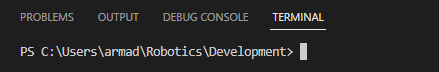

# Library 

This should hold all of the common robot code to be developed and used throughout the years for our projects. I have split the document into what concerns collaborators and what concerns maintainers.

## Collaborators
If you're here you are a collaborator that is working on one of our robot projects that requires this library as a submodule.
### Cloning a project with git submodules
When running git clone on a repo with submodules pass the `--recurse-submodules` flag to git. <br>
`git clone urltorepo --recurse-submodules` <br>
### Using a project with git submodules
After you run git pull in a repo with submodules it only updates what commit they point to and does not update submodules themselves. To do that you must run this command after git pull. <br>
```
git submodule update --init --recursive
```
However there is a config to make git automatically run this command after every pull; **I strongly recommend** setting this config. <br>
```
git config --global submodule.recurse true
``` 
## Maintainers
Docs for using git submodules: https://git-scm.com/book/en/v2/Git-Tools-Submodules <br>
You should be updating the versions of GradleRIO and vendor dependencies in your projects so they match that of the library as new updates are released. 
### Spotless
This project has spotless in its gradle configuration. This is a code formatter and can be run with `./gradlew spotlessApply`. If your code isn't correctly formatted don't worry it won't fail the build.
### Adding the library to a project
**Important** - Before adding the library to a project you should have basic knowledge of git, gradle and navigating around directories. <br>
Make sure you're in the project's root directory in the terminal. <br>
 <br>
To add library as a submodule. <br>
```
git submodule add -b master https://github.com/Armada2508/Library library
```
Of course if you want to track commits from a different branch then replace master with a branch of your choice.

Add `implementation ':library'` to your dependencies block in build.gradle. <br>
Add `includeBuild 'library'` to the end of your settings.gradle.

Make sure source and target compatibility in build.gradle match that of the library, right now it's Java 17. <br>
Make sure GradleRIO version matches. <br>
Make sure you have all vender deps installed for the library to work and that they're all up to date. Currently only CTRE Phoenix 6. <br>

*Note* - It might be important to add `"java.gradle.buildServer.enabled": "off"` to your VSCode settings.json file depending on your VSCode extensions. [Extension Issue](https://github.com/microsoft/vscode-gradle/issues/1435). <br>
**Important** - I would run `./gradlew build` before continuing. <br>
### Updating your submodules
If you're at the root directory and you want to update the commit that the submodule points to on the branch specified in .gitmodules. (Pull from upstream)<br>
`git submodule update --remote` <br>
Every time you update the library and you want to advance the commit that your repo points to you must run this. <br>
Alternatively you could do this from the library's git but make sure you're on a branch. <br>
`cd library` <br>
`git switch branchname` - if necessary <br>
`git pull` <br>
Finally from your main repository you can commit the updated submodule's reference and push it for everyone else to grab.  
### Editing library from within a project
Once you want to start working on the library as a submodule from within another project you need to checkout a branch. <br>
`cd library` <br>
`git switch branchname` <br>
If you've updated the submodule since the last time you checked out a branch you probably need to run `git pull` in the library's directory. <br>
Now you can make your changes and when you're finished commit and push them.

If you're at the root directory and want to pull new changes to the submodule from upstream, add the merge flag to not delete your local changes. <br>
`git submodule update --remote --merge`

If you're at the root directory and you want to push committed changes from the submodule. <br>
`git push --recurse-submodules=on-demand`

VSCode source control tab should help out with using submodules or you can stick with commands in the terminal, both work.
