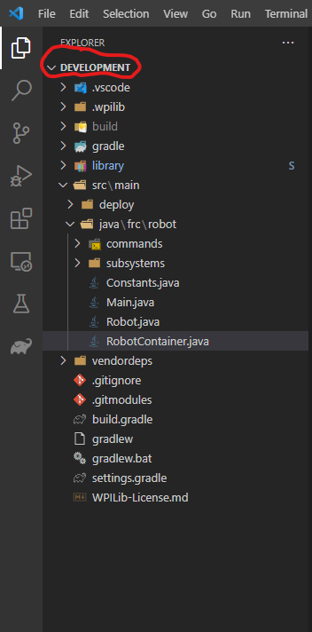

# Library 

This should hold all of the common robot code to be developed and used throughout the years for our projects. You should be updating the versions of GradleRIO and vendor dependencies at the same rate as projects so the versions always match.

## Adding to a project
**IMPORTANT** - Before adding the library to a project you should have basic knowledge of git, gradle and navigating around directories.  
Make sure you're in the project's root directory in the terminal.  
  
  
To add library as a submodule.  
`git submodule add https://github.com/Armada2508/Library library`

Add `implementation ':library'` to your dependencies block in build.gradle.  
Add `includeBuild 'library'` to your settings.gradle.

Make sure source and target compatibility in build.gradle match that of the library, right now it's Java 17.
Make sure GradleRIO version matches.

Make sure you have all vender deps installed for the library to work and that they're all up to date. Currently just CTRE Phoenix.

To pull updates from upstream.  
`git submodule update --remote`

## Editing library from within a project
Docs for using git submodules: https://git-scm.com/book/en/v2/Git-Tools-Submodules

Once you want to start working on the library as a submodule from within another project you need to checkout a branch.  
`git checkout master`

Add the merge flag to not delete your changes when pulling from upstream.  
`git submodule update --remote --merge`

Commit your changes and then when you want to push it, if you're at the root directory run this.  
`git push --recurse-submodules=on-demand`

Otherwise just cd into the directory and manually git push from there.
VSCode source control tab will help out a lot with using submodules so you can rely on that.
